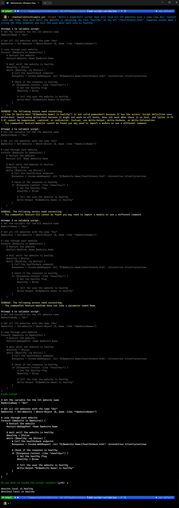

# GPTPwshValidator

This is a first cut at addressing two of the main problems I've encountered with LLM generated scripting, I've got a cold at the moment so my brain isn't sharp enough to finish this up but it's good enough to demo the intent.  

The script uses PSScriptAnalyzer to validate the script output of the model is valid PowerShell and after that uses the PowerShell Abstract Syntax tree to validate the parameters being passed to commandlets are actually valid. Cleaning this up and extending it to do more validation could enable us to produce higher quality PowerShell script output from LLMs. Having access to the AST so easily means you can parse all args and check validity of types etc. before attempting to run the script.  

In the current state here it works quite neatly albeit verbose.

## Example

```pwsh
.\PwshValidatorExample.ps1 -Prompt "Write a powershell script that does something"
```

